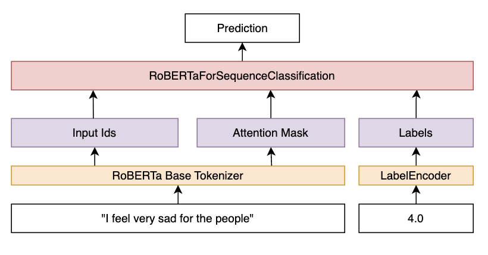
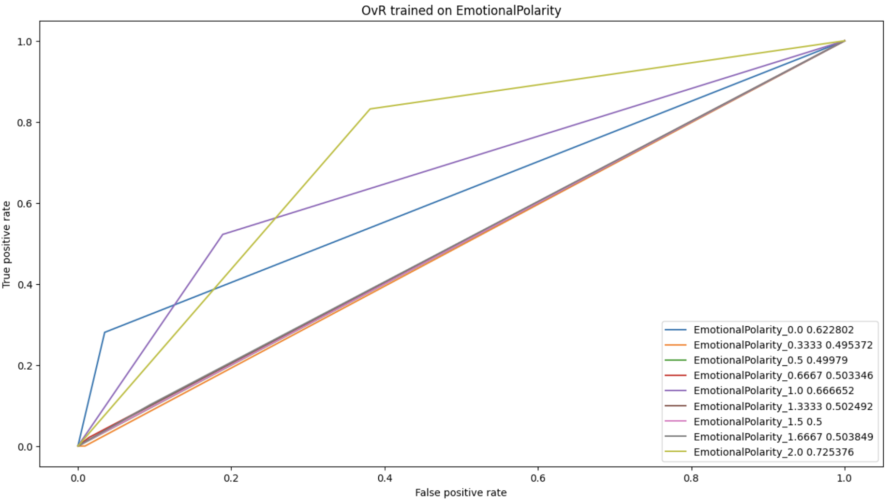
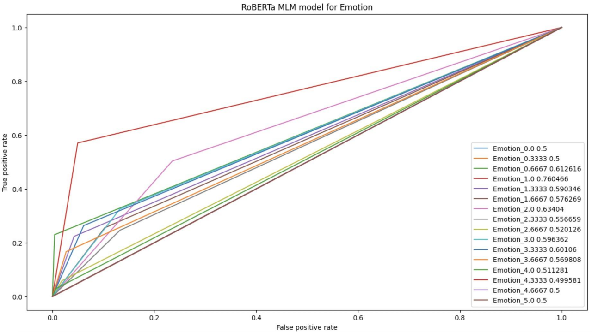
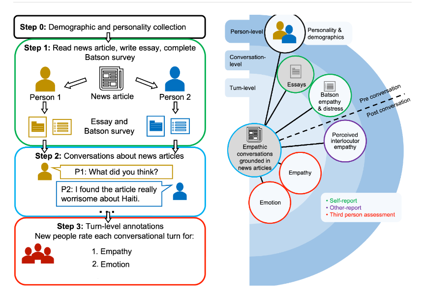
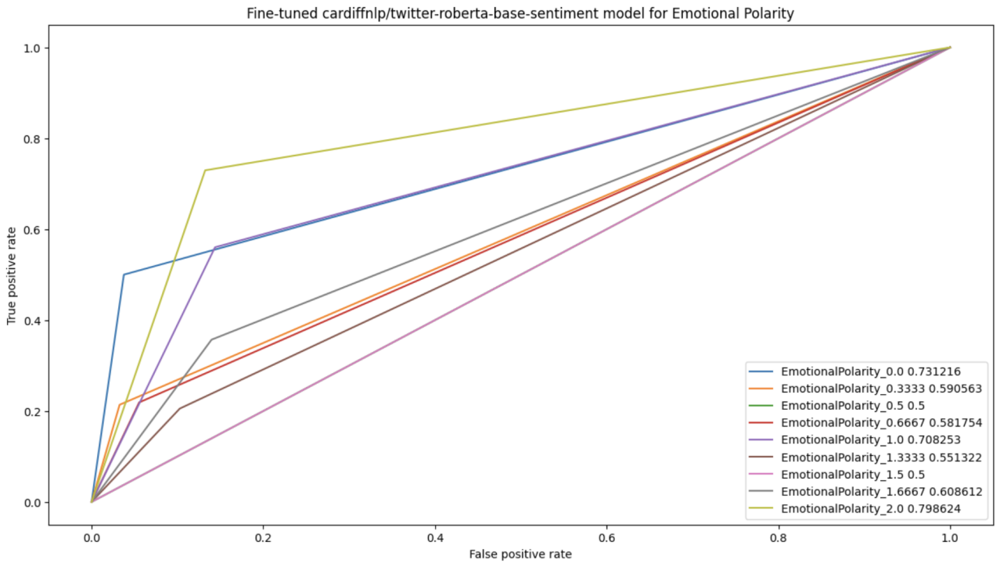
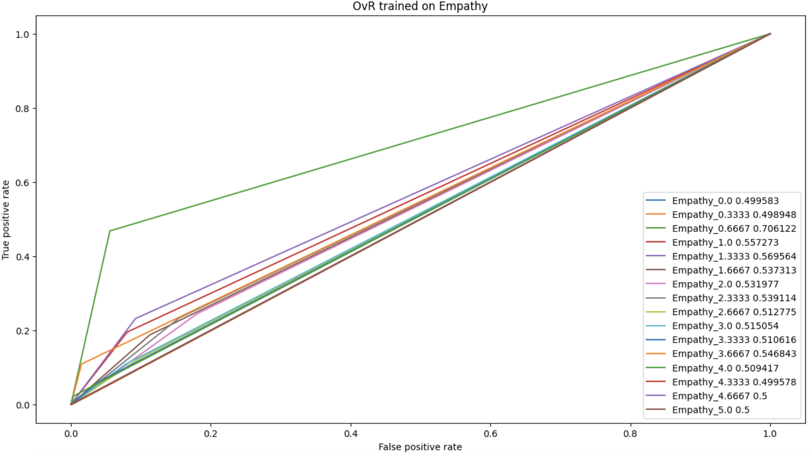
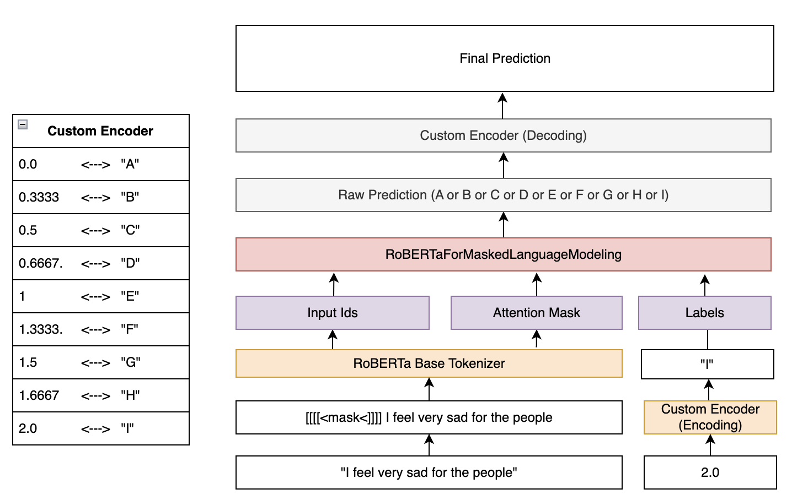
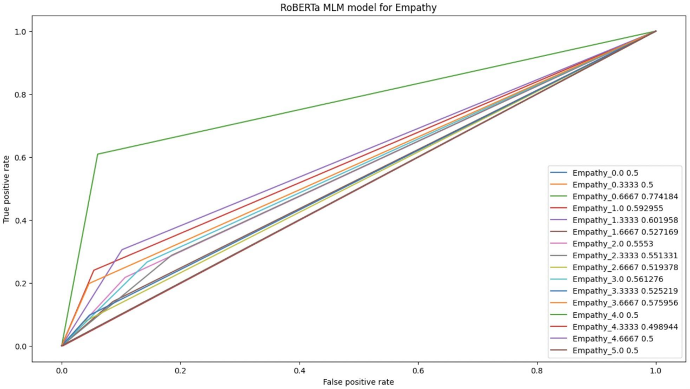
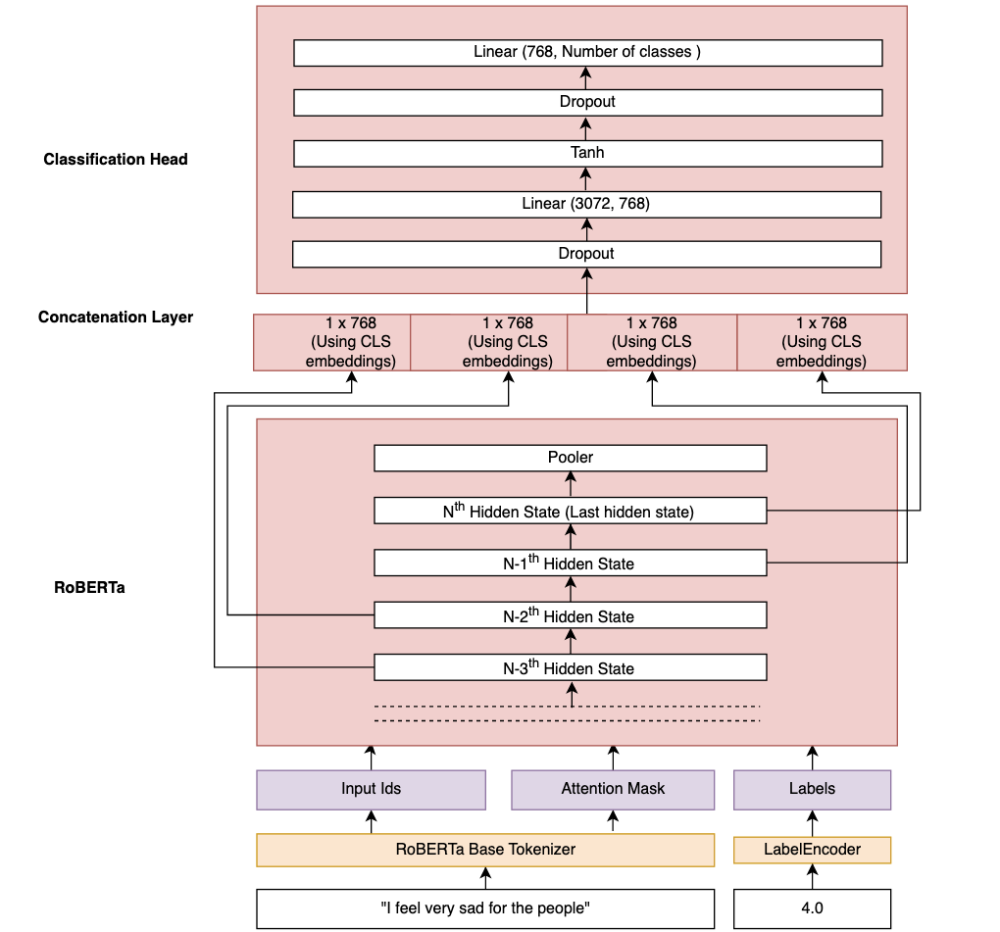
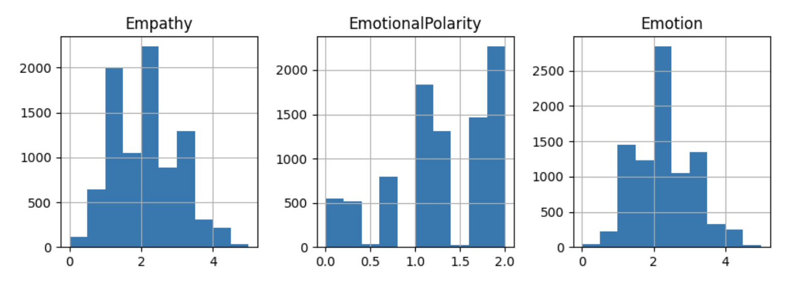

<strong>May 17, 2023</strong>

<strong><a href="https://codalab.lisn.upsaclay.fr/competitions/11167#learn_the_details-overview">WASSA 2023 Shared Task on Empathy Detection and Emotion Classification
  and Personality Detection in Interactions</a></strong>

<strong>Track 1: Empathy and Emotion Prediction in Conversations (CONV)</strong>

 
<strong>University of Maryland</strong>

Xiaoyan Feng, Vladimir Rife, Sushant Karki

<strong>1. Introduction:</strong>

	The task our group set out to solve was WASSA’s 2023 Shared Task on Empathy
Emotion and Personality Detection in Interactions track 1: Empathy and Emotion
Prediction in Conversations. The goal of our problem was to predict the measure
of emotional polarity (negative/positive emotion), emotional intensity (strength
of that emotion), and empathy towards an article topic discussed in
conversations between participants of WASSA’s 2023 data collection experiment.
The purpose of solving this problem is to better quantify the type, intensity,
and interpersonal effects of emotion as communicated through natural language
like the conversations from WASSA’s experiment. If a reliable algorithm trained
on such conversations could be applied to any human text, we might be able to
advance many fields of science and technology like chatbots, mood-tracking,
therapy, medical diagnoses, behavioral prediction, etc.

<strong>2. The Dataset:</strong>

	The dataset WASSA provided for their shared tasks was collected in 4 stages
(visual figure given below). In Stage 0, they collected demographic and
personality data on the participants and recorded it. In Stage 1, those
participants were told to read one of their finite number of news articles and
write their reaction to it down in the form of a 300-800 character essay and
Batson survey. In Stage 2, participants who had read the same article were
paired together to have a recorded conversation about it. And then, in Stage 3,
annotators went through the recorded text of those conversations on a
turn-by-turn basis and evaluated the emotional polarity, emotional intensity,
and empathy the participant showed toward the article subject on a [0,2] scale
for emotional polarity and [0,5] scale for emotional intensity and empathy. It
is also important to note that the emotional polarity, emotional intensity, and
empathy scores are not continuous values within their given ranges, but rather,
discrete values in increments of thirds within them (so, ⅓, ⅔, 1, 4/3, and so
on…).

<strong>3. Baseline Model(s) and Performance Metrics:</strong>

	The initial baseline model we chose by which to measure the rest of our models
up against was a One-vs-rest (OvR) Logistic Regression model. OvR logistic
regression is a type of binary classification algorithm in which a single class
is compared against all other classes in a multi-class classification problem,
by training one binary logistic regression classifier for each class to
distinguish it from the rest of the classes. The metrics we used to measure the
performance of the baseline model, and all our other models, were their
Accuracy, F1 scores, and Pearson R scores. We chose these metrics because
accuracy demonstrates the proportion of correctly classified instances over the
total number of instances across all classes, F1-score provides a balanced
measure (via the harmonic mean between precision and recall) of the model's
ability to correctly identify positive instances and avoid false negatives, and
the Pearson R score demonstrates the strength and direction of the linear
relationship between the predicted and actual values, providing a good
indication of how well the model’s prediction fits the data’s true labels. As we
can see in the figures and table assessing these metrics in our baseline model
below, the results are not as good as we would like (none of the scores
meaningfully reach above a value of 0.5). But, this is to be expected in a
baseline. The following sections will show how we improve upon this.

<strong>3.1 Baseline model for Emotional Polarity:</strong>

<h1>Figure 1: ROC curve for Baseline Emotional Polarity classifier</h1>

	From figure1, we can clearly find that the category of score 2 has the best ROC
curve; the category of score 1 is the second one; 0 is the third. Other than
these three categories, they all overlap at the diagonal of this Coordinate
System, which shows that this OvR cannot distinguish these categories. As far as
we can see, the reason for this phenomenon is caused by the unbalance of the
data, and implies that the smaller the difference of labels are, the harder the
model could classify. The trials of label smoothing and generating similar data
in the Emotional Polarity model are based on these findings.

<strong>3.2 Baseline model for Emotional Intensity:</strong>

<h1>Figure 2: ROC curve for Baseline Emotion classifier</h1>

Unlike Figure 1, most of the categories are higher than 0.5. This image looks
like a better baseline model since this model works in classifying among most
labels.

<strong>3.3 Baseline model for Empathy:</strong>

<h1>Figure 3: ROC curve for Baseline Empathy classifier</h1>

	As it shows in this chart, OvR performs not so well but it is a nice fit to be
a baseline model as well, and we can find Figure 2 and Figure 3 are similar
which means the two models have similar discriminative power in distinguishing
between positive and negative samples.

<strong>3.4 Baseline Performance Metrics:</strong>

<table>
  <tr>
   <td>
   </td>
   <td>
<h1><strong>Emotional Polarity</strong></h1>
   </td>
   <td>
<h1><strong>Emotional Intensity</strong></h1>
   </td>
   <td>
<h1><strong>Empathy</strong></h1>
   </td>
  </tr>
  <tr>
   <td>
<h1><strong>F1 score</strong></h1>
   </td>
   <td>
<h1>0.386</h1>
   </td>
   <td>
<h1>0.205</h1>
   </td>
   <td>
<h1>0.185</h1>
   </td>
  </tr>
  <tr>
   <td>
<h1><strong>Accuracy</strong></h1>
   </td>
   <td>
<h1>0.386</h1>
   </td>
   <td>
<h1>0.205</h1>
   </td>
   <td>
<h1>0.185</h1>
   </td>
  </tr>
  <tr>
   <td>
<h1><strong>Pearson R score</strong></h1>
   </td>
   <td>
<h1>0.5074</h1>
   </td>
   <td>
<h1>0.512</h1>
   </td>
   <td>
<h1>0.516</h1>
   </td>
  </tr>
</table>
<h1>Table 1</h1>

	As in the table shown above, there are three metrics for each model. Overall,
F1 score is equal to the accuracy score for all models, and empathy is the
lowest in this scenario. The metrics of the following optimization models also
show a sorting like this.

<strong>4. Problem Formulation:</strong>

	From our exploratory data analysis, we found that the Empathy, Emotional
Polarity and Emotion scores are decimal values in the range [0, 5] for Empathy
and Emotion and [0, 2] for Emotional Polarity. Based on the fact that the scores
are float values, the problem can be formulated as a Regression problem.

	Upon further exploring the data, it can be seen that rather than a continuous
distribution, the Empathy, Emotional Polarity and Emotion scores take discrete
values in their specific range. The possible scores for Empathy, Emotional
Polarity and Emotion are as follows:

<table>
  <tr>
   <td>
   </td>
   <td><strong>Possible Values</strong>
   </td>
  </tr>
  <tr>
   <td><strong>Empathy</strong>
   </td>
   <td>0.0, 0.3333, 0.6667, 1.0, 1.3333, 1.6667, 2.0, 2.3333, 2.6667, 3.0,
3.3333, 3.6667, 4.0, 4.3333, 4.6667, 5.0
   </td>
  </tr>
  <tr>
   <td><strong>Emotion</strong>
   </td>
   <td>0.0, 0.3333, 0.6667, 1.0, 1.3333, 1.6667, 2.0, 2.3333, 2.6667, 3.0,
3.3333, 3.6667, 4.0, 4.3333, 4.6667, 5.0
   </td>
  </tr>
  <tr>
   <td><strong>Emotional</strong> <strong>Polarity</strong>
   </td>
   <td>0.0, 0.3333, 0.5, 0.6667, 1.0, 1.3333, 1.5, 1.6667, 2.0
   </td>
  </tr>
</table>
<h1>Table 2</h1>

	While formulating the problem as a Classification problem, it can also be noted
that the individual classes have an ordering in them. For example, in the
possible values in the Emotional Polarity scores shown in the table above, it
can be seen that there is an ordering among the classes, i.e. 0.0 < 0.3333 < 0.5
< 0.6667 < ……… < 1.6667 < 2.0. This makes it possible to formulate this problem
as an Ordinal Regression (also called Ordinal Classification Problem).

	We tried all three methods (Regression, Classification and Ordinal Regression)
to model our problem. Some details of each of them are as follows:

<strong>4.1 Regression:</strong>

	During our initial attempts at modeling this problem, we focused on a
regression based approach. We chose the Mean Squared Loss as our loss function
and trained the model to minimize it for each of Empathy, EmotionalPolarity and
Emotion. Since with a regression based approach the model outputs a value in a
continuous distribution, during inference, we chose the class that is closest to
the output of the model for our final prediction.

<strong>4.2 Classification:</strong>

	While we experimented with regression for our initial models, we got better
results with classification and ended up formulating most of our models as
classification. The choice of loss function was Categorical Cross Entropy.

<strong>4.3 Ordinal Regression:</strong>

	Since our categories have a strict ordering, we also attempted Ordinal
Regression/Classification following the approach in the paper “A neural network
approach to ordinal regression” by Cheng, J. (2007).

	We first encoded the labels as a vector where all the labels before the actual
label are also hot (basically similar to one-hot encoding but with all the zeros
preceding the hot bit also set to 1). For example, we have the following
possible labels for Emotional Polarity:  [0.0, 0.3333, 0.5, 0.6667, 1.0, 1.3333,
1.5, 1.6667, 2.0]

	Let’s say a sample has an emotional polarity score of 0.5. We encode the
emotional polarity of this sample as [1, 1, 1, 0, 0, 0, 0, 0, 0]. We note that
in this vector, the bits for the emotional polarity scores of 0.0 and 0.3333 are
also on. This is basically implying that anything that has an emotional polarity
of 0.5 will definitely have an emotional polarity of 0 and 0.3333.

	After encoding the labels in this special vector, we used the MSE loss as our
loss function to train our model (Cheng, J. stated in his findings that both
Cross Entropy (classification) and Mean Squared Error (regression) losses work
equally well).

	During inference, we use the index of the rightmost class that has a sigmoid
activation of over 0.5 as our prediction. For example, for the model’s output
(sigmoid activated) of [0.9, 0.9, 0.6, 0.57, 0.4, 0.2],  we choose the class of
the 4th element i.e. 0.57 as our prediction (because 0.57 is the rightmost
element that has a value of 0.5 or more).

	We didn’t get better results than regular classification with this approach, so
we did not use ordinal regression in our final models.

<strong>5. Things we tried:</strong>

	We attempted a number of different models and architectures to solve our
classification problem. Rather than choosing a single model and performing
hyperparameter tuning on it, we chose to focus more on experimenting with
different models and comparing their performances.

	To make sure that we were comparing apples to apples and not oranges, and to
make sure that any improvement in the performance came from mostly from the
model architecture and not from the hyperparameter tuning aspect of training, we
fixed our hyperparameters for our Transformer models to the following settings
to compare different approaches:

<table>
  <tr>
   <td><strong>Parameter</strong>
   </td>
   <td><strong>Value</strong>
   </td>
   <td><strong>Note</strong>
   </td>
  </tr>
  <tr>
   <td>Number of Epochs
   </td>
   <td>3
   </td>
   <td>After about 3 epochs, we found that most of our models started to overfit
   </td>
  </tr>
  <tr>
   <td>Learning Rate
   </td>
   <td>1e-5
   </td>
   <td>
   </td>
  </tr>
  <tr>
   <td>Batch Size
   </td>
   <td>8
   </td>
   <td>We got better results with a low batch size for most models, so we fixed
it to 8 for comparison
   </td>
  </tr>
  <tr>
   <td>Weight Decay
   </td>
   <td>0.01
   </td>
   <td>
   </td>
  </tr>
  <tr>
   <td>Warmup steps
   </td>
   <td>500
   </td>
   <td>
   </td>
  </tr>
  <tr>
   <td>Max Token Length
   </td>
   <td>96
   </td>
   <td>96 was good enough for our speech-turn data
   </td>
  </tr>
</table>
<h1>Table 3</h1>

<strong>5.1 Fine tuning a Base RoBERTA model with a classification head</strong>

	RoBERTa is a transformer-based language model, and is an extension of the
popular BERT model. Before doing anything fancy, we wanted to see how a
minimally tuned basic RoBERTa model would perform in our classification task. We
used the Sequence Classification class of “roberta-base” from huggingface and
changed the number of categories of the classification head to match ours and
fine-tuned it for a few epochs.

<h1>Figure 4. Fine-tuning a Base RoBERTa Model with a Classification Head (for
prediction Empathy)</h1>

<strong>5.2 Feature-based approach with RoBERTA</strong>

	It was mentioned in the BERT paper that the authors found better results in
classification by concatenating the hidden states of the last 4 layers of BERT
instead of using just the last hidden state. We thought this could be a viable
approach and attempted it with RoBERTa.

With this feature-based approach, we tried two different methods:

<ol>
<li>Using the hidden states while freezing the RoBERTa model

    With this method, we froze the weights of the pretrained RoBERTa base model
and trained only the classification head. We configured RoBERTa to output all
the hidden states and not just the last hidden state. Then we concatenated the
output of the hidden layers side by side and fed it into the classification
head. For the number of hidden layers we used, we tried using just the last 4
hidden layers just as in the BERT paper and also tried using all the hidden
layers.

<ol>
<li>Using the hidden states while fine-tuning the pretrained model

    Just as in the previous approach, we configured RoBERTa to output all the
hidden states and not just the last hidden state. But this time, we did not
freeze the pertained model. The model was trained in a similar fashion as the
previous approach.

</li>
</ol>
</li>
</ol>

Figure 5. Using Hidden states from the last 4 layers of RoBERTa

	We found that not freezing the weights of RoBERTa performed better than
freezing the base RoBERTa model. However, overall, we did not see a notable
improvement in our model’s overall performance compared to just fine-tuning a
base RoBERTa and using the CLS token embeddings of the last hidden state.

<strong>5.3 Using a model pre-trained for Sentiment Analysis</strong>

	As things like Empathy, Emotion and Sentiment are similar (not the same), we
had a hypothesis that a model that is trained specifically for Sentiment
analysis might perform better than a basic RoBERTa model. To test this
hypothesis, we searched for various pre-trained Sentiment Analysis models on
huggingface. We chose the mode “Twitter-roBERTa-base for Sentiment Analysis”
from CardiffNLP because it was trained on a very large corpus of Twitter tweets
for Sentiment Analysis. We tried fine-tuning this model for Empathy, Emotion and
Emotional Polarity. While it did not perform as well as we expected on Empathy
and Emotion, fine-tuning it for classifying Emotional Polarity gave us the best
results out of all of our models for predicting Emotional Polarity.

<strong>5.4 Masked Language Modeling approach</strong>

	While playing around with transformer models, we came across Masked Language
Models in huggingface. Masked Language Model is a language model that predicts
the missing words (the masked value) in a given sentence based on the context.
By treating our labels as a part of the text, we tried framing our problem as a
Masked Language Modeling problem. Here is a summary of how we did our modeling:

<ol>
<li>Encoded each class as an alphabet. This was to make sure that each class was
represented by a single character (we think this could be anything that is in
the tokenizer’s vocabulary as long as it’s a single token). For example, for
Emotional Polarity, we used the following encodings

    0 → “A”, 0.333 → “B”, ……………..,  1.6667 → “H”, 2.0 → “I”

<ol>
<li>Created a masked speech-turn text.

    For example, let’s say the sentence “That is such a sad news story” has an
Emotional Polarity of 1.6667. We prepend the string “[[[[<mask>]]]] “ in front
of it to get the masked speech-turn text, which now becomes “[[[[<mask>]]]] That
is such a sad news story”.

    Notice the signs “[[[[“ and “]]]]” that appear before and after the <mask>
token. We added these irregular signs because we thought that enclosing the mask
with the same pattern in all samples would help make better predictions because
for all samples in the training data there is always a single alphabet (class)
between A and I enclosed by these signs and because of this, probability-wise,
the model will only predict characters from A to I (our encoded classes) for the
mask.

<ol>
<li>Tokenized the masked speech-turn text from 2. using a RoBERTa tokenizer
(with special tokens enabled). For our labels for the mask, we used the
encodings from step 1.
<li>Trained the Masked Language Model.
<li>Decoded the characters predicted by the masked language model (“A” to “I”
for Emotional Polarity) back to the original classes and used them as our
prediction.
</li>
</ol>
</li>
</ol>
</li>
</ol>

Figure 6. Using Masked Language Modeling Approach (for predicting Emotional
Polarity)

	This model did not outperform the basic RoBERTa Sequence Classification
approach. However, since the performances were similar, we decided to use this
approach as our final model for Empathy and Emotion as we thought it was a more
non-traditional approach.

<strong>5.5 RoBERTa with LSTM</strong>

	We used word embeddings from RoBERTa as our input to a LSTM classifier (the
weights of the pretrained RoBERTa were frozen) as one of our modeling
approaches. We experimented with different architectures and parameters of the
LSTM model (stacked/not stacked, unidirectional/bi-directional, etc) to try to
improve our performance, but unfortunately this approach could not outperform
the basic fine-tuned RoBERTa model.

<strong>5.6. Other experiments</strong>

	Aside from the different kinds of models we tried, we also attempted a few
other approaches to try to improve our models’ performance.

 5.6.1 Data Preprocessing

	The class distribution for each of Empathy, Emotion and Emotional Polarity was
very imbalanced.

Figure 7. Histogram of Empathy, EmotionalPolarity and Emotion

	We attempted to remove the class imbalances by random undersampling and random
oversampling using the <em>imbalanced-learn</em> library. However, we did not
have a lot of success with either of these methods.

5.6.2. Data Augmentation

	To introduce more variation to our speech-turn data and to increase the size of
our training data, we performed data augmentation by paraphrasing the
speech-turn level text. To do this, we used the Parrot paraphraser library. With
this, we could increase the size of our training data to about 24,000, a 3X
increase in our training data size. For each paraphrase, we copied the Empathy
scores of the original text. We only trained for Empathy using this data because
we thought that for labels other than Empathy (Emotion and Emotional Polarity),
the choice of words in the paraphrase might impact the emotion intensity and
polarity and therefore, for those two labels, copying the corresponding label
from the original text would not be justified.

	We could get a slight improvement in Empathy prediction performance with this
approach.

5.6.3. Confident Learning

	While exploring our training data, we found that we had some noisy labels (eg.
having different scores for the same/similar text). We did some literature
review on approaches that can be taken to reduce such noise in text data and
came across the paper “Confident Learning: Estimating Uncertainty in Dataset
Labels” by Northcutt et al. The paper introduces a framework that uses a
probabilistic model to estimate the confidence or uncertainty of each label in a
dataset. Northcutt et al. have also open-sourced a python library called
<em>cleanlab </em>that can be used to easily detect noisy labels in datasets.

	We used this library to find noisy labels in our training data and found that
this library indeed helps detect data points that are outliers and that are easy
to be misclassified by the models to a certain extent. It gives a number
estimate of the “label quality” with a lower number implying bad quality and a
high number implying the label is good. After detecting weak labels from the
dataset, we dropped samples whose label quality was below a certain threshold
and trained our models with the higher quality data points. The performance does
seem to increase a little bit, but not by a large margin that we were expecting.

5.6.4. Label Smoothing

	Since we framed most of our models as classification, we attempted to boost
performance by applying label smoothing on our data. Label smoothing is a
regularization technique that helps a model to generalize better in
classification tasks. Usually for classification tasks, since we use one-hot
encodings as true labels and sigmoid activations as predictions, the model can
never acquire a zero loss because the sigmoid function can never output exactly
0 or 1. 			Apparently this hard boundary between the classes makes the model
make overconfident predictions. Label smoothing is a way of addressing this
issue by smoothing the true labels and changing the one-hot vector to a more
smooth representation eg. [0, 0, 1] → [0.05, 0.05, 0.9] This reduces the
overconfidence problem and gives a chance for the model to predict the other
classes as well.

	Since we adopted label smoothing late in our project, we have not been able to
thoroughly evaluate the impact of applying label smoothing in our performance.

5.6.5. Cosine annealing with hard restarts

	We found that sometimes resetting the learning rate and epochs and training the
same model instance further helped our model converge better. We think this was
because of the high learning rate at the starting epochs (because of the
resetting) that helped the model go over a local minima that it had gotten stuck
at the end of the previous epoch (where the learning rate has decayed to a small
value). While researching for approaches to handle this, we found the concept of
cosine annealing with restarts. The idea is to use the cosine wave as a decay
function and once a certain rate is reached, the learning rate is restarted
(reset) to the original value, from where it starts to decay again. We used the
Huggingface’s Trainer class’s “lr_scheduler_type” option to use cosine annealing
with hard restarts in our models.

	Similar to label smoothing, since we adopted label smoothing late in our
project, we have not been able to thoroughly evaluate the impact of applying
this in our performance.

<strong>6. Our Final Models:</strong>

	As a result of all the modeling and optimization approaches mentioned above for
predicting EmotionalPolarity, Emotion and Empathy, we selected one model each
for Empathy, Emotional Polarity and Emotion as our final models. For predicting
Emotional Polarity, fine-tuning the pre-trained CardiffNLP Sentiment Analysis
outperformed all of our other models by a large margin, so we picked that as our
Emotional Polarity classifier. For Empathy and Emotion, we chose the models that
we trained using the Masked Language Modeling approach because we thought this
was an interesting approach and also because its performance was comparable to
fine-tuning a RoBERTa model for classification.

	The ROC curves and the final metrics of each of our best models are as follows:

<strong>6.1 Emotional Polarity:</strong>

Figure 8. Class-wise ROC curve for Emotional Polarity

<table>
  <tr>
   <td>
   </td>
   <td><strong>Pearson R Score</strong>
   </td>
   <td><strong>F1_score</strong>
   </td>
   <td><strong>Accuracy</strong>
   </td>
  </tr>
  <tr>
   <td><strong>Final model</strong>
   </td>
   <td>0.7689
   </td>
   <td>0.4667
   </td>
   <td>0.4667
   </td>
  </tr>
  <tr>
   <td><strong>Baseline model</strong>
   </td>
   <td>0.5074
   </td>
   <td>0.3860
   </td>
   <td>0.3860
   </td>
  </tr>
</table>
<h1>Table 4</h1>

<strong>6.2 Emotional Intensity:</strong>

Figure 9. Class-wise ROC curve for Emotional Intensity

<table>
  <tr>
   <td>
   </td>
   <td><strong>Pearson R Score</strong>
   </td>
   <td><strong>F1_score</strong>
   </td>
   <td><strong>Accuracy</strong>
   </td>
  </tr>
  <tr>
   <td><strong>Final model</strong>
   </td>
   <td>0.7452
   </td>
   <td>0.2888
   </td>
   <td>0.2888
   </td>
  </tr>
  <tr>
   <td><strong>Baseline model</strong>
   </td>
   <td>0.5115
   </td>
   <td>0.2050
   </td>
   <td>0.2050
   </td>
  </tr>
</table>

Table 4

<strong>6.3 Empathy:</strong>

Figure 10. Class-wise ROC curve for Empathy

<table>
  <tr>
   <td>
   </td>
   <td><strong>Pearson R Score</strong>
   </td>
   <td><strong>F1_score</strong>
   </td>
   <td><strong>Accuracy</strong>
   </td>
  </tr>
  <tr>
   <td><strong>Final model</strong>
   </td>
   <td>0.6631
   </td>
   <td>0.2200
   </td>
   <td>0.2200
   </td>
  </tr>
  <tr>
   <td><strong>Baseline model</strong>
   </td>
   <td>0.5160
   </td>
   <td>0.1850
   </td>
   <td>0.1850
   </td>
  </tr>
</table>

Table 5

	Overall, with our final models, the F1 score, Accuracy and Pearson R scores
increased with respect to the baseline model. Based on the classwise ROC curves
listed below, we can see that the final models have varying degrees of success
based on the class. For example, our model for predicting Emotional Polarity has
AUC of 73, 70 and 79 for Emotional Polarity of 0.0, 1.0 and 2.0 respectively.
However, it has comparatively lower AUC (mostly between 0.5 to 0.6) for other
classes, implying that the model can easily classify some classes while it has a
harder time classifying some other classes.

<strong>7. Conclusion:</strong>

	This study aimed to predict perceived Empathy, Emotional Polarity, and
Emotional Intensity in conversation using three main approaches: fine-tuning a
Base RoBERTa model, a feature-based approach using RoBERTa, and a Masked
Language Modeling approach with RoBERTa. Instead of focusing on hyperparameter
tuning, we focused on comparing the different models against each other and
finding which model is inherently better, with hyperparameters being the same.
Our findings suggest that fine-tuning a transformer pre-trained on sentiment
analysis achieved the best results for classifying Emotional Polarity. For
predicting Emotion and Empathy, fine-tuning a RoBERTa model alone yielded decent
outcomes. Additionally, we devised a method to use Masked Language Modeling for
classification by manipulating the input data and leveraging the Masked Language
Model to predict label values. Although the results were not exceptional, the
performance was comparable to fine-tuning a base RoBERTa Sequence Classification
model. Hence, we selected the Masked Language Model for predicting Empathy and
Emotion scores in the WASSA shared task due to its intriguing nature.

	Overall, there was a significant improvement in accuracy and F1 scores across
all three categories, with Emotional Polarity accuracy more than doubling.
Furthermore, the Pearson R score enhanced for all categories, with Emotional
Polarity exhibiting the largest increase. These results emphasize the potential
of natural language processing and machine learning techniques to accurately
predict and comprehend the complex emotions conveyed in human conversations. The
impact of computers understanding emotions and empathy is intricate and
multifaceted.

<strong>8. Limitations:</strong>

	For as much as we were able to accomplish in formulating solutions for our
task, there were still limitations we encountered which prevented us from
creating as high-performing models as we had hoped. For one, it appears the data
is imbalanced, with some scores having a very high representation in the dataset
while some scores had only a handful of samples. This could also have been the
reason that the class-wise ROC curves were very different for different classes.
We also suspect that there was some noise in the labels, as well. For example,
speech-turn text like “Bye bye” has higher scores  in emotional polarity,
emotional intensity, and empathy than another turn with the text “Bye”, despite
the two turns’ text differing very little. Annotations like this could lead the
model to believe such similar text to differ more than the average person might
think, which could have resulted in training toward inaccurate predictions.
Finally, less technically, we were computationally limited in our use of Google
Colab’s free-trial GPU. While this did provide a better system of collaboration
between us, we would occasionally get kicked off the GPU system time we were
allocated, resulting in us either having to wait until our allotted time
refreshed, or needing to create new Google accounts. If we were not limited in
these ways, our model might have performed better with better data to train on,
and we might have used our time more efficiently without needing to deal with
Google Colab’s GPU limitations.

<strong>9. References:</strong>

Barbieri, F., Camacho-Collados, J., Espinosa Anke, L., & Neves, L. (2020).
TweetEval: Unified Benchmark and Comparative Evaluation for Tweet
Classification. In Findings of the Association for Computational Linguistics:
EMNLP 2020 (pp. 1644-1650). Association for Computational Linguistics.

Cheng, J. (2007). A neural network approach to ordinal regression (Version
arXiv:0704.1028v1). Retrieved from https://doi.org/10.48550/arXiv.0704.1028

Damodaran, P. (2021). Parrot: Paraphrase generation for NLU (Version v1.0)
[Computer software]. Retrieved from
https://github.com/PrithivirajDamodaran/Parrot

Devlin, J., Chang, M. W., Lee, K., & Toutanova, K. (2018). BERT: Pre-training of
Deep Bidirectional Transformers for Language Understanding. arXiv preprint
arXiv:1810.04805.

Liu, Y., Ott, M., Goyal, N., Du, J., Joshi, M., Chen, D., ... & Stoyanov, V.
(2019). RoBERTa: A robustly optimized BERT pretraining approach. arXiv preprint
arXiv:1907.11692.

Northcutt, C. G., Jiang, L., & Chuang, I. L. (2019). Confident Learning:
Estimating Uncertainty in Dataset Labels (Version 6). arXiv preprint
arXiv:1911.00068

